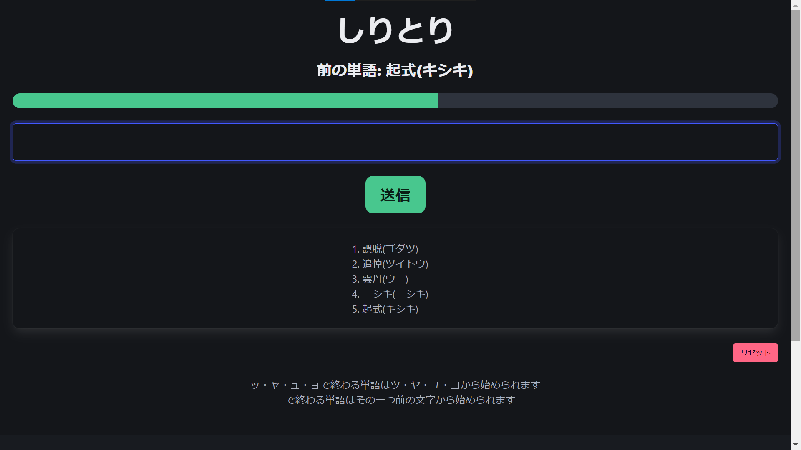

# jigjp-internship-2024

## Website
[このDenoサーバー](https://tamagosushi-jigjp-intern.deno.dev/index.html)からすぐにプレイできます。(Cookieを使用します)

## Overview
しりとりができるWebアプリです。

## Requirement
- Deno v1.44.4
- Bulma v1.0.0

## Usage
1. リポジトリをクローン
2. `/private/BCCWJ_frequencylist_suw_ver1_1.zip`を`/private`に解凍
3. ルートディレクトリで、`deno run --allow-net --allow-read server.js`を実行

## Description
- しりとりに使用できるのは単語リストに登録されているもののみです
- Cookieを使用して別々にしりとりができます
- 最初の単語はランダムに決定されます
- 入力にはひらがな、またはカタカナが使えます
- 送信ボタンだけでなく、入力中にEnterを押すことでも送信できます
- 単語の履歴がリストとして表示されます
- 1単語の制限時間は10秒です
### GameOver条件
- 10秒が経過する
- 入力した単語が"ん"で終わる
- 過去に入力した単語を再度入力する

## Reference
- [Deno Manual ファイルの読み書き](https://deno-ja.vercel.app/manual/examples/read_write_files) (閲覧 2024年6月20日)
- [『二分探索アルゴリズムを一般化 〜 めぐる式二分探索法のススメ 〜』](https://qiita.com/drken/items/97e37dd6143e33a64c8c) (閲覧 2024年6月24日)
- [『現代日本語書き言葉均衡コーパス』短単位語彙表 ver1.1](https://repository.ninjal.ac.jp/records/3235) (閲覧・ダウンロード 2024年6月25日)

## Author
Tamagosushio

